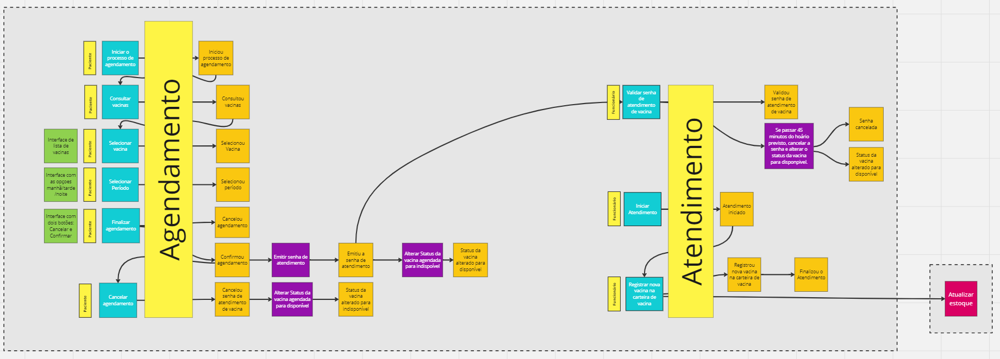
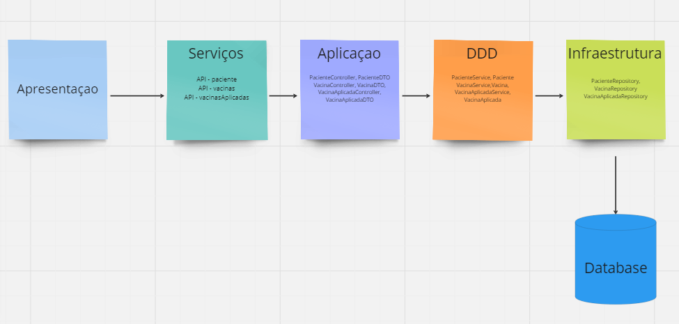

# SGV- Sistema de Gerenciamento de Vacinas
O Sistema de Gerenciamento de Vacinas é um sistema tem como objetivo otimizar e sistematizar o gerenciamento de 
vacinações e campanhas de vacinação. Esta documentação detalhará a arquitetura e os domínios do sistema, 
além de fornecer justificativas para as decisões arquiteturais.

## 1. Curl para import no postman
### Paciente
Cria Paciente

curl --location 'http://localhost:8080/paciente' \
--header 'Content-Type: application/json' \
--data '{
    "nome": "dataNascimento",
    "email": "email@gmail.com",
    "senha": "senha",
    "rg": "rg",
    "dataNascimento": "2023-10-27",
    "numeroSus": 1234
}'

Busca Paciente

curl --location --request GET 'http://localhost:8080/paciente/5a7e7b41-f9b0-42fa-8104-831ba03a3181' \
--header 'Content-Type: application/json' \
--data ''

Atualiza Paciente

curl --location --request PUT 'http://localhost:8080/paciente/5a7e7b41-f9b0-42fa-8104-831ba03a3181' \
--header 'Content-Type: application/json' \
--data '{
    "nome": "dataNascimento Atualizado",
    "numeroSus": 1234,
    "email": "email_atualizado@gmail.com",
    "senha": "senha_atualizado",
    "rg": "rg_atualizado",
    "dataNascimento": "2023-11-27"
}'

Deleta Paciente

curl --location --request DELETE 'http://localhost:8080/paciente/5a7e7b41-f9b0-42fa-8104-831ba03a3181' \
--data ''

### Vacinas
Cria Vacina

curl --location 'http://localhost:8080/vacinas' \
--header 'Content-Type: application/json' \
--data '{
    "nomeVacina": "CoronaVac",
    "numeroLote": 1652,
    "quantidade": 55980
}'

Busca vacina

curl --location --request GET 'http://localhost:8080/vacinas/3a000d97-629d-4b89-89e5-4b7ae706b4a5' \
--header 'Content-Type: application/json' \
--data '{
    "id": "3a000d97-629d-4b89-89e5-4b7ae706b4a5",
    "nomeVacina": "CoronaVac",
    "numeroLote": 1652,
    "quantidade": 55980
}'

Busca Todas Vacinas

curl --location --request GET 'http://localhost:8080/vacinas' \
--header 'Content-Type: application/json' \
--data '{
    "nomeVacina": "CoronaVac",
    "doseVacina": "Primeira Dose",
    "numeroLote": 123,
    "quantidade": 5980
}'

Atualiza Vacina

curl --location --request PUT 'http://localhost:8080/vacinas/dcb1199d-fe34-4e11-9ab5-aab2f9c8633d' \
--header 'Content-Type: application/json' \
--data '{
    "nomeVacina": "CoronaVac",
    "doseVacina": "Primeira Dose",
    "numeroLote": 123,
    "quantidade": 8980
}'

Deleta Vacina

curl --location --request DELETE 'http://localhost:8080/vacinas/dcb1199d-fe34-4e11-9ab5-aab2f9c8633d' \
--data ''

# VacinasAplicadas

Cria VacinaAplicada

curl --location 'http://localhost:8080/vacinasAplicadas' \
--header 'Content-Type: application/json' \
--data '{
    "vacina":{
    "id": "d18f3814-e5e1-4ef6-8177-242e6be278ad",
    "nomeVacina": "Coronavac",
    "doseVacina": "Segunda Dose",
    "numeroLote": 1652,
    "quantidade": 5548980
},
"nomeVacina": "Coronavac",
"doseVacina": "Segunda Dose",
"dataAplicacao": "2023-10-29",
"numeroLote": 1652
}'

Atualizada VacinaAplicada

curl --location --request PUT 'http://localhost:8080/vacinasAplicadas/83579284-0f94-4938-af4c-1aa30e45ac6b' \
--header 'Content-Type: application/json' \
--data '{
    "vacina":{
    "id": "d18f3814-e5e1-4ef6-8177-242e6be278ad",
    "nomeVacina": "Coronavac",
    "doseVacina": "Segunda Dose",
    "numeroLote": 1111,
    "quantidade": 5548980
},
"nomeVacina": "Coronavac",
"doseVacina": "Segunda Dose",
"dataAplicacao": "2023-10-29"
}'

Deleta VacinaAplicada

curl --location --request DELETE 'http://localhost:8080/vacinasAplicadas/83579284-0f94-4938-af4c-1aa30e45ac6b' \
--data ''

Busca Todas VacinasAplicadas

curl --location 'http://localhost:8080/vacinasAplicadas' \
--data ''

Busca VacinaAplicada

curl --location 'http://localhost:8080/vacinasAplicadas/83579284-0f94-4938-af4c-1aa30e45ac6b' \
--data ''

### Unidade
Cria Unidade

curl --location 'http://localhost:8080/unidade' \
--header 'Content-Type: application/json' \
--data '{
    "nome" : "Unidade Teste",
    "registroUnidade" : 85,
    "situacao" : "Não Operante",
    "vacinas": "COVID-19"
}'

Busca Unidade

curl --location --request GET 'http://localhost:8080/unidade/4c3ba847-6d3f-4230-bd63-80bb6ffb6d7b' \
--header 'Content-Type: application/json' \
--data ''

Busca Todas Unidades

curl --location --request GET 'http://localhost:8080/unidade' \
--header 'Content-Type: application/json' \
--data ''

Atualiza Unidade

curl --location --request PUT 'http://localhost:8080/unidade/4c3ba847-6d3f-4230-bd63-80bb6ffb6d7b' \
--header 'Content-Type: application/json' \
--data '{
"nome": "Unidade Teste Atualizada",
"registroUnidade": 90,
"situacao": "Operante",
"vacinas": "COVID-19#~#Gripe"
}'

Deleta Unidade

curl --location --request DELETE 'http://localhost:8080/unidade/4c3ba847-6d3f-4230-bd63-80bb6ffb6d7b' \
--data ''

### Enfermeiro
Cria Enfermeiro

curl --location 'http://localhost:8080/enfermeiro' \
--header 'Content-Type: application/json' \
--data '{
    "nome": "dataNascimento",
    "email": "email@gmail.com",
    "senha": "senha",
    "rg": "rg",
    "dataNascimento": "2023-10-27",
    "numeroCoren" : 123
}'

Busca Enfermeiro

curl --location --request GET 'http://localhost:8080/enfermeiro/def098ba-3c8f-4d13-9ae6-b1e71bad6d61' \
--header 'Content-Type: application/json' \
--data ''

Atualiza Enfermeiro

curl --location --request PUT 'http://localhost:8080/enfermeiro/def098ba-3c8f-4d13-9ae6-b1e71bad6d61' \
--header 'Content-Type: application/json' \
--data '{
"id": "def098ba-3c8f-4d13-9ae6-b1e71bad6d61",
"nome": "dataNascimento Atualizado",
"email": "email_atualizado@gmail.com",
"senha": "senha_atualizado",
"rg": "rg_atualizado",
"dataNascimento": "2023-12-27",
"numeroCoren": 789
}'

Deleta Enfermeiro

curl --location --request DELETE 'http://localhost:8080/enfermeiro/def098ba-3c8f-4d13-9ae6-b1e71bad6d61' \
--data ''

## 2. História
Um hospital XPTO precisa que seu controle de vacinas seja otimizado e sistematizado em um software que possibilite que 
um funcionário cadastre as vacinas nos sistemas bem como as unidades de sauda ou locais onde haverá atendimento de vacina 
que vão prestar o serviço de vacinação, o sistema também deve permitir que o funcionário cadastre campanhas de vacinas 
bem como os locais onde ocorrerá a vacinação da população. Além disso, é necessário que o sistema seja capaz de 
gerenciar a demanda das vacinas por meio de senhas, onde o paciente seja capaz de acessar o sistema marcar um atendimento 
de vacina, esse atendimento funciona como se fosse a senha do usuário contendo, o local, hora do agendamento o número da senha, 
tal como nome e o número de CNS do usuário. O sistema também deve possibilitar ao paciente cancelar o atendimento caso 
esse ele não consiga comparecer. O sistema também deve possibilitar que um médico, enfermeiro, auxiliar de enfermagem ou 
qualquer funcionário da área da saúde trabalhando na unidade ou local de atendimento acesse o sistema, 
consulte a carteira de vacina de um paciente mediante o nome ou número do CNS, importante também que o sistema permita 
que esses profissionais registrem vacinas na carteira de vacina do paciente, por meio da senha ou demanda 
(Demanda consiste em situações onde o paciente já está no local de atendimento e há vacinas disponíveis para serem aplicadas). 
Com relação às senhas o hospital tem como política a invalidação da senha do usuário caso ele não comparar no local de agendamento 
para vacina tendo como tolerância 45 minutos após o horário marcado, caso contrário o sistema deve liberar o sistema 
para emissão de novas senha para a vacina, a senha estando invalidada o usuário necessita emitir uma nova senha 
para receber os serviços de vacinação. Quanto ao paciente, todas as vacinas registradas deverão constar em uma 
carteira de vacina virtual. A carteira de vacina deve ser atualizada sempre que houver um serviço de vacina realizada, ou seja, 
o paciente compareceu ao local e recebeu o atendimento pelo profissional da saúde que realizou a aplicação da vacina. 
O paciente também deve ser capaz de consultar sua carteira de vacina no sistema.

## 3. Event Storming:
O processo de Event Storming foi conduzido para identificar os principais eventos, comandos, agregados e fluxos de informações do sistema. O diagrama de Event Storming completo está disponível separadamente e inclui eventos como "Agendamento de Vacina," "Registro de Vacinação," "Cancelamento de Atendimento," e outros.

Workshop de Event Storming
* Participantes: Equipe de desenvolvimento, especialistas de negócios.
* Escopo: Sistema de Gerenciamento de Vacinas.
* Objetivos: Identificar eventos, comandos, agregados e fluxos de informações.

## 4. Arquitetura Proposta:
O sistema será desenvolvido com o padrão MVC para permitir uma separação clara das responsabilidades entre os componentes do sistema.

## 5. Dominios Identificados:
Agendamento
* Responsabilidades: Gerenciar o agendamento de vacinações pelos pacientes.
* Comportamentos: Permitir aos pacientes agendar e cancelar vacinações.

Atendimento
* Responsabilidades: Gerenciar o atendimento da vacina agendada.
* Comportamentos: Permite o enfermeiro efetuar o atendimento do paciente agendado.

## 6. Justificativas:
A escolha do padrão MVC é apropriada para sistemas que necessitam de uma clara separação de preocupações entre a interface do usuário, a lógica de negócios e o armazenamento de dados.

## 7. Conclusão e reflexões finais:
Podemos concluir que o Event Storming promove a colaboração entre membros da equipe, como desenvolvedores, 
especialistas de domínio e usuários finais, tornando possível identificar todas as funcionalidades essenciais. 
Ele também ajuda a entender o domínio do negócio, uma vez que se concentra em eventos de domínio, permitindo uma 
melhor compreensão do contexto em que o sistema vai operar, tornando o processo de desenvolvimento mais organizado e eficaz.
